

# System 1 — Manual QA & Agile Ownership

## 📋 Problem

Handed a 5-line requirement doc for saucedemo.com's checkout flow: *"Valid login
works. Invalid login shows an error. Items can be added to the cart. Cart count is
accurate. Checkout completes successfully."* Nothing about edge cases, duplicate
submissions, session behavior, or multi-tab consistency — the real gaps a QA analyst
has to find before they become production bugs.

## 🎯 What I Did

- Wrote a formal test plan (objective, scope, approach, tools, timeline)
- Identified 5 unstated assumptions in the requirement doc before designing a single test case
- Designed 12 risk-ranked test cases (High/Medium/Low) covering login, cart, and checkout
- Executed all 12 cases manually against the live application with full evidence capture
- Logged one observation (sort dropdown hitbox issue) with root-cause reasoning

## 🔍 Key Findings

All 12 scripted, risk-ranked test cases passed on the standard `standard_user` flow —
login, cart accuracy, checkout, and rapid double-click submission all behaved
correctly with no duplicate orders, and cart state stayed consistent across two open
tabs. Additional adversarial/exploratory testing beyond the written test plan
surfaced **6 defects and 1 UX observation** — a "Reset App State" sync bug, a stale
browser-history session bug, a non-functional clear icon, and visual/functional/data
defects across the app's special test accounts (`problem_user`,
`performance_glitch_user`, `error_user`, `visual_user`). Full details in
`defect-log.md`.

---

## 🖼️ Execution Evidence

### Login & Access Control
| Valid Login | Invalid Credentials | Locked-Out User |
|---|---|---|
| 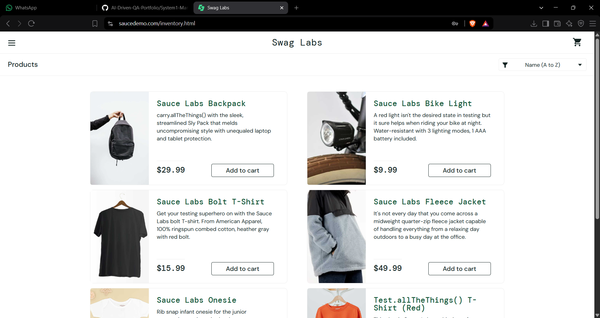 |  | 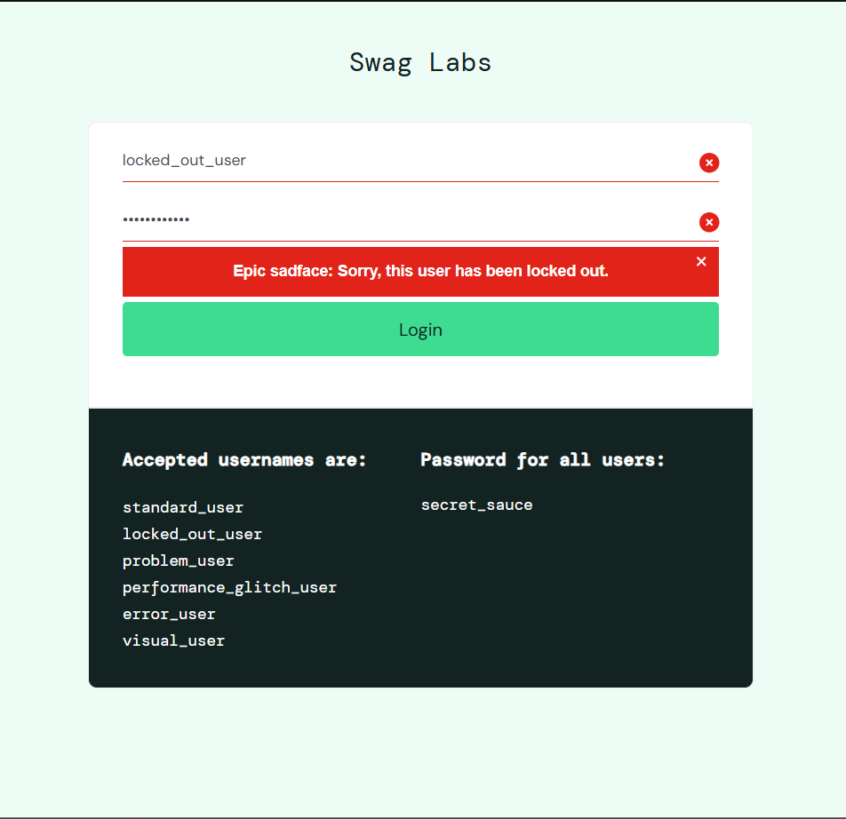 |
| TC01 — Pass | TC02 — Pass | TC03 — Pass |

### Cart Operations
| Single Item Added | Multiple Items Added | Item Removed |
|---|---|---|
| 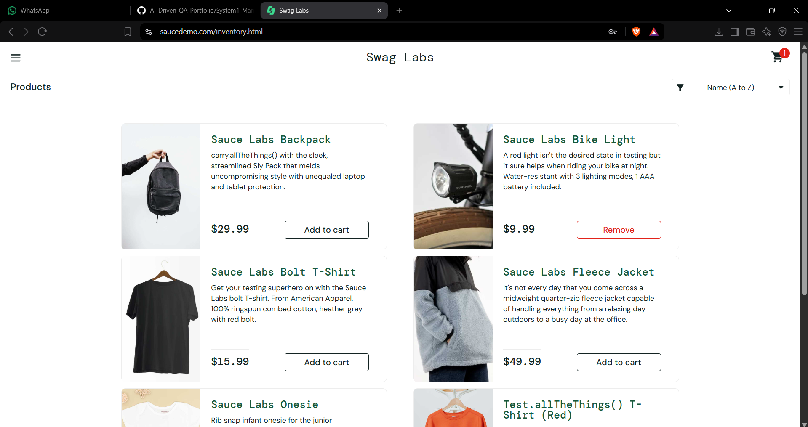 | 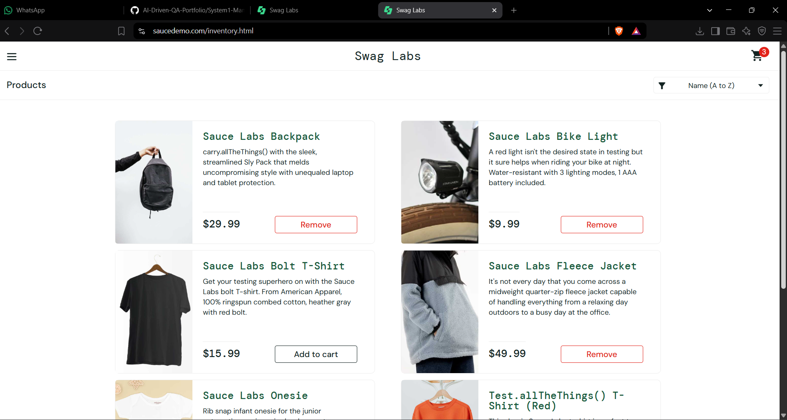 | 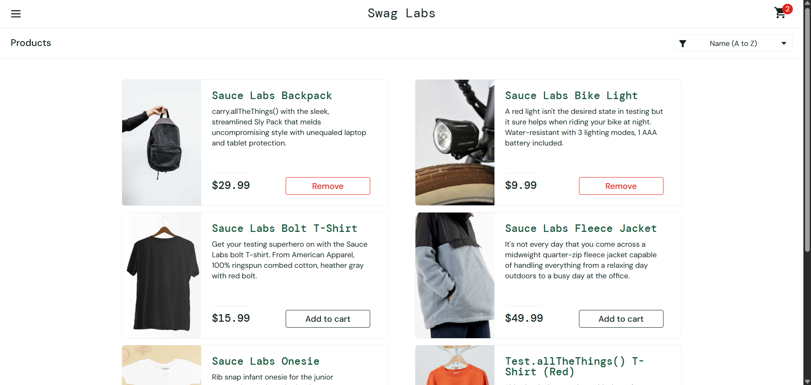 |
| TC04 — Pass | TC05 — Pass | TC06 — Pass |

| Badge Accuracy (Add+Remove) | Cross-Tab Sync |
|---|---|
| 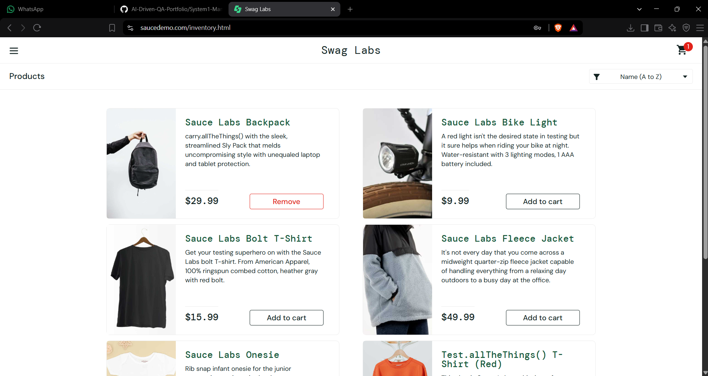 | 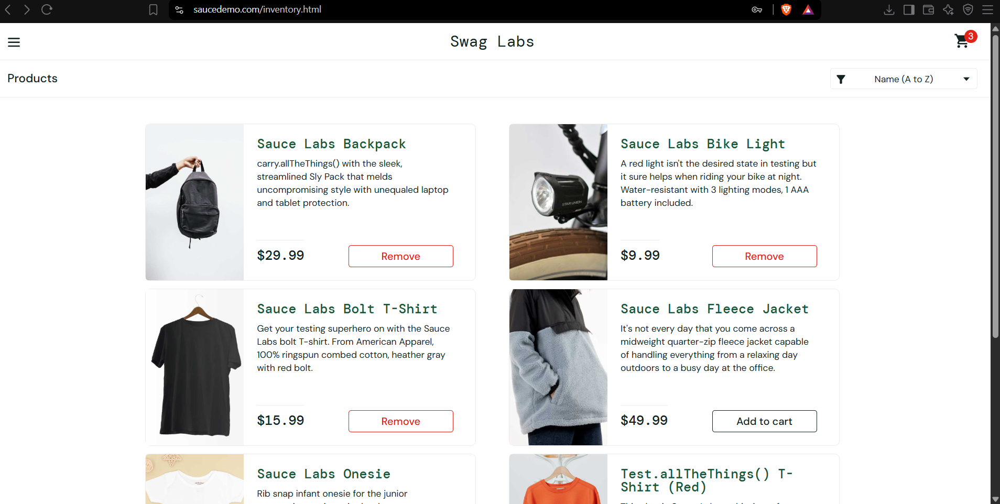 |
| TC07 — Pass | TC08 — Pass |

### Checkout Flow
| Valid Checkout | Empty Fields Validation | Double-Click Guard |
|---|---|---|
| 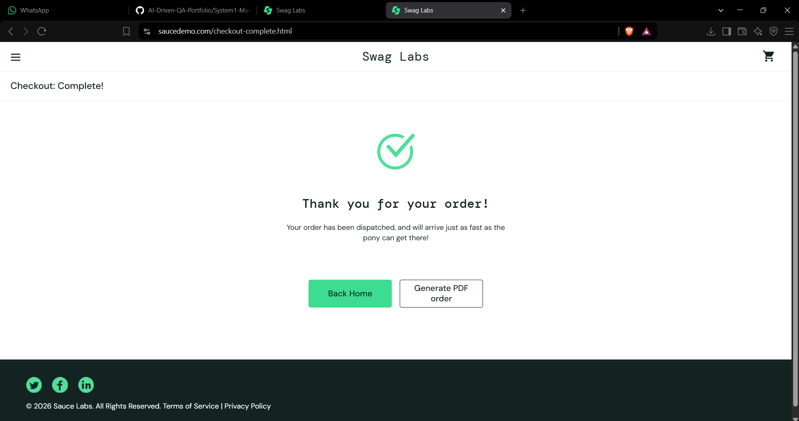 | 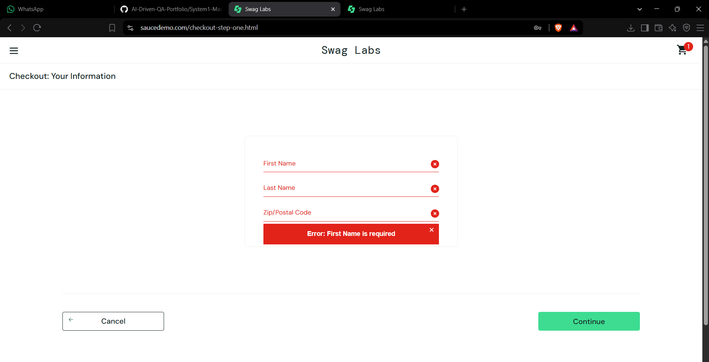 | 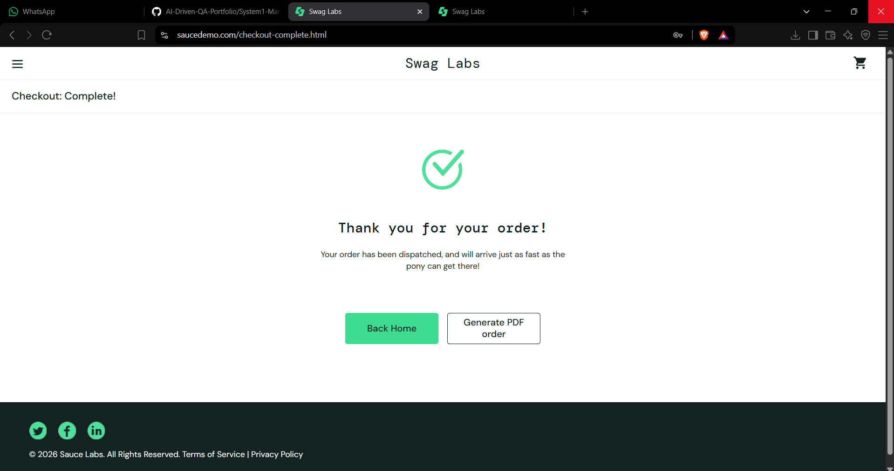 |
| TC09 — Pass | TC10 — Pass | TC11 — Pass |

### Sorting
| Price Sort (Low to High) |
|---|
| 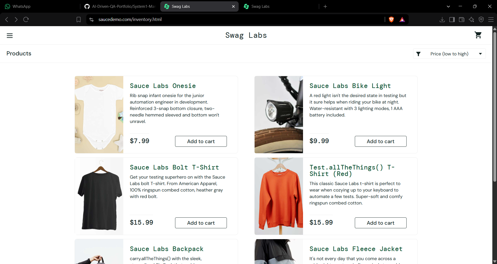 |
| TC12 — Pass |

---

<strong>🐞 Bug Evidence (click to expand)</strong>

 

| Reset State Sync (BUG-01) | Corrupted History Page (BUG-02) | Second Login Fails (BUG-03) |
|---|---|---|
|  |  |  |

| Clear Icon Non-Functional (BUG-04) | problem_user (BUG-05) | performance_glitch_user (BUG-05) |
|---|---|---|
| 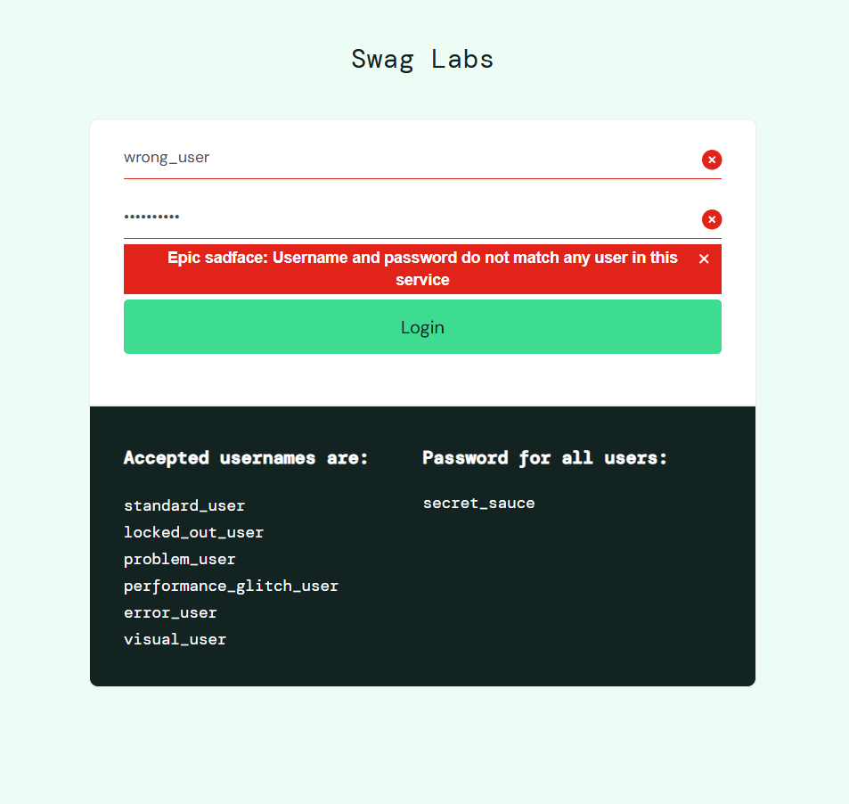 |  |  |

| error_user (BUG-05) | visual_user (BUG-05) | Price Glitch (BUG-06) |
|---|---|---|
|  |  | 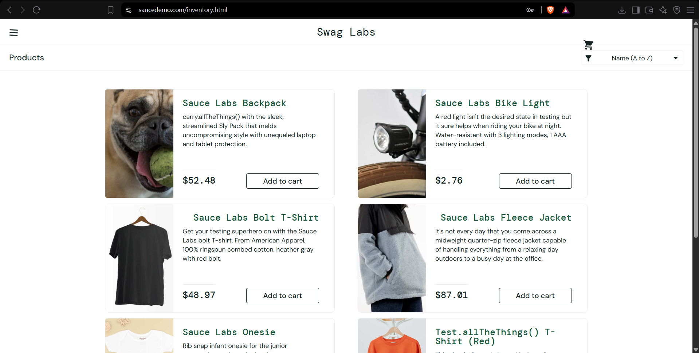 |

| Sort Dropdown Hitbox (OBS-01) |
|---|
|  |

---

## 📁 Artifacts in This Folder

| File | Description |
|---|---|
| `test-plan.md` | Objective, scope, approach |
| `clarification-log.md` | 5 unstated requirement assumptions identified upfront |
| `test-cases.csv` | 12 risk-ranked test cases with full Actual/Status results |
| `defect-log.md` | 6 defects + 1 observation, each with root-cause reasoning and screenshot evidence |
| `screenshots/` | Execution evidence for all 12 test cases plus bug evidence |

## ✅ Result

**Go, with follow-ups.** All 12 scripted test cases passed with no functional defects
in the core flow. 6 additional defects and 1 UX observation were found through
exploratory testing beyond the written plan — full evidence and root-cause reasoning
for each in [`defect-log.md`](defect-log.md). None block release for the core
`standard_user` journey, but BUG-01 through BUG-04 should be triaged before the next
sprint.

