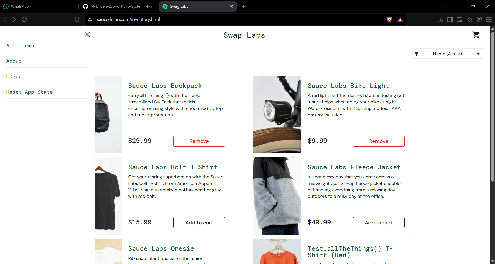
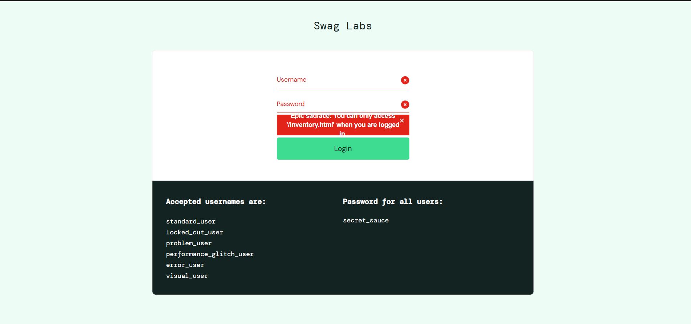
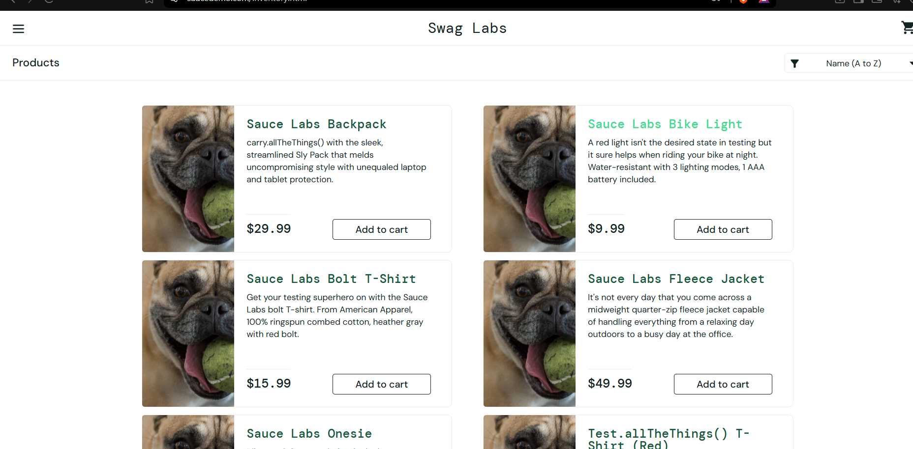
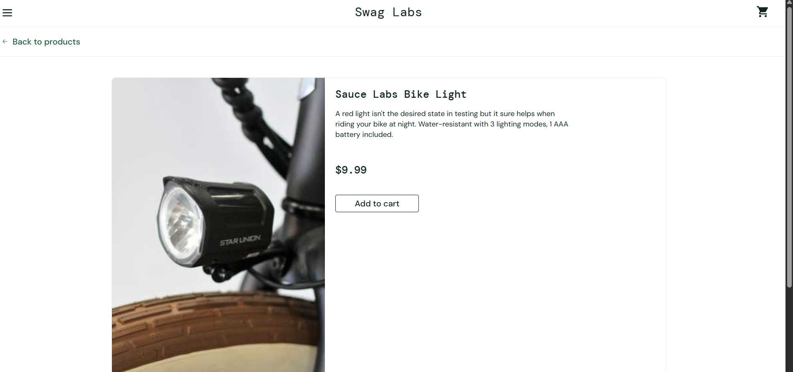
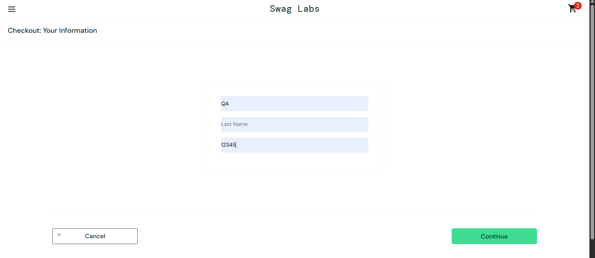

# Defect & Observation Log

## BUG-01: Reset App State does not revert "Remove" buttons
**Severity:** Medium | **Priority:** Medium
**Steps to Reproduce:**
1. Add one or more items to cart (buttons change to "Remove")
2. Open ☰ menu → click "Reset App State"
**Expected:** Cart badge clears to 0 AND all "Remove" buttons revert to "Add to cart"
**Actual:** "Remove" buttons remain displayed after reset instead of reverting to
"Add to cart" — the button state is not synced with the reset action.
**Root Cause:** The reset function likely clears the underlying cart data/count but
does not re-render or re-bind the individual product button states on the current page.
**Environment:** Chrome/Brave, Desktop

---

## BUG-02: Corrupted page when reopening via browser history
**Severity:** Medium | **Priority:** Low
**Steps to Reproduce:**
1. Log in and browse the app
2. Close the tab/browser
3. Reopen using browser History (clicking a past cookie/session entry)
**Expected:** A clean login page or a valid session state
**Actual:** Page renders in a broken/corrupted visual state.
**Root Cause:** The page is likely being restored from browser back-forward cache
(bfcache) or a stale history entry without re-fetching styles/scripts.
**Environment:** Chrome/Brave, Desktop

---

## BUG-03: Second login requires re-entering the URL manually
**Severity:** Medium | **Priority:** Medium
**Steps to Reproduce:**
1. Reach the corrupted page state described in BUG-02
2. Try to log in again from that page
**Expected:** Login should work directly from the current page
**Actual:** The page shown is a plain, unstyled login page (accepted usernames /
password list visible but layout broken); logging in from here does not work — the
URL must be manually re-typed in a new tab to reach a working login page.
**Root Cause:** Likely tied to BUG-02 — the corrupted/cached page state breaks the
page's ability to process a fresh login submission.
**Environment:** Chrome/Brave, Desktop

---

## BUG-04: Clear ("x") icon on username field is non-functional
**Severity:** Low | **Priority:** Low
**Steps to Reproduce:**
1. Type a username with a typo into the username field
2. Click the "x" (clear) icon inside the field
**Expected:** Field text is cleared
**Actual:** Clicking the "x" icon does not clear the field text.
**Root Cause:** The icon is likely decorative / not wired to a clear() handler on the input.
**Environment:** Chrome/Brave, Desktop

---

## BUG-05: Visual/functional defects across special test user accounts
**Severity:** Medium | **Priority:** Low (test-account-specific, intentional by design)
**Steps to Reproduce:** Log in individually as each user below and browse the product grid / checkout.

| User | Observed Issue | Evidence |
|---|---|---|
| `problem_user` | All product images are replaced with an unrelated dog image |  |
| `performance_glitch_user` | Only the Sauce Labs Bike Light renders as an oversized image on the product page; other products don't display correctly alongside it |  |
| `error_user` | Last Name field on checkout does not accept text input; Continue click has no effect, so the order can never be completed |  |
| `visual_user` | Backpack shows a dog image; cart icon and cart-page buttons/layout are visibly misaligned; product prices are also randomized/incorrect (e.g. $52.48 shown for a $29.99 item) — flow still completes through to the Thank You page |   |

**Root Cause:** These are SauceDemo's built-in "broken" test accounts, intentionally
seeded with front-end/data bugs to give QA testers realistic defects to find. Each
user isolates a different bug category — data/image mapping, rendering, functional
blocking, and layout/CSS.
**Environment:** Chrome/Brave, Desktop

---

## BUG-06: Login error banner overlaps password field's clear icon
**Severity:** Low | **Priority:** Low
**Steps to Reproduce:**
1. Try accessing a protected page (e.g. /inventory.html) directly without logging in
2. Observe the login page that loads with the error banner shown
**Expected:** Error banner should not cover the password field's clear ("x") icon
**Actual:** The red error banner text renders directly on top of the password field's
clear icon, making both hard to read and click in that spot.
**Root Cause:** Error banner is likely absolutely positioned without accounting for
the input field's icon, causing a layout/z-index overlap.
**Environment:** Chrome/Brave, Desktop

---

## OBS-01: Sort dropdown arrow icon has no click handler
**Severity:** Low | **Priority:** Low
**Steps to Reproduce:**
1. Go to Products page
2. Click directly on the dropdown arrow icon (not the text) for the sort control
**Expected:** Dropdown opens
**Actual:** Dropdown does not open at all when clicking the arrow icon; clicking the
visible text label ("Name (A to Z)") is the only way that reliably opens it.
**Root Cause:** The arrow icon appears to be a purely decorative/visual element with
no click handler attached, while the actual interactive element is scoped to the
text label only.
**Environment:** Chrome/Brave, Desktop

---

## Notes
All 12 core risk-ranked test cases (TC01–TC12) passed on the standard `standard_user`
flow. The defects above were surfaced through additional adversarial/exploratory
testing beyond the scripted cases — including the app's special user accounts and
browser navigation edge cases — which is a standard part of a QA analyst's ownership
beyond the written test plan.
