<a id="top"></a>
<div align="center">

# 🔎 System 2 — API + Database Integrity Testing

**End-to-end API lifecycle testing + SQL-based database integrity validation, backed by root-cause analysis.**

[]()
[]()
[]()
[]()

[]()
[]()

Part of the **[AI-Driven QA Portfolio](../)**

</div>

### 📑 Contents
- [Overview](#-overview)
- [Final Result](#-final-result)
- [Project Structure](#-project-structure)
- [API Testing — 13 Requests](#-api-testing--13-requests)
- [Database Integrity — 8 SQL Queries](#️-database-integrity--8-sql-queries)
- [Evidence Walkthrough — Screenshot Gallery](#️-evidence-walkthrough--screenshot-gallery)
- [Root Cause Analysis Highlights](#-root-cause-analysis-highlights)
- [Tools & Tech Used](#️-tools--tech-used)

---

## 📌 Overview

This project simulates a real-world QA workflow that spans two layers of a system:

1. **API Layer** — A full user lifecycle (Register → Login → Get → Update → List → Delete) tested against [reqres.in](https://reqres.in), including auth, chaining, negative, and idempotency scenarios.
2. **Database Layer** — 8 targeted SQL integrity queries run against the **Chinook** reference database to check for referential integrity, duplicates, business-rule violations, and fraud-review signals.

Every unexpected or noteworthy result is backed by a documented **5-Whys Root Cause Analysis**, not just a pass/fail label — reflecting how a QA engineer would actually investigate anomalies in a production environment.

## ✅ Final Result

| Layer | Checks Run | Passed | Notes |
|---|---|---|---|
| API | 13 | 13 | 1 expected mock-API behavior (see RCA) |
| SQL / Database | 8 | 8 | Clean dataset, all queries production-ready |

**Recommendation: 🟢 GO** — No blocking defects. See [`integrity-report.md`](./integrity-report.md) for full details.

---

## 📁 Project Structure

```
System2-API-DB-Integrity/
├── README.md                 → You are here
├── integrity-report.md       → Full test report (API + SQL results, Go/No-Go call)
├── rca-log.md                → 5-Whys root cause analysis for key findings
├── sql-queries.sql           → All 8 SQL integrity queries + inline results
├── postman/
│   └── System2-API-DB-Integrity.postman_collection.json  → Importable Postman collection (all 13 requests)
└── screenshots/              → Evidence captures for every test step, numbered in order
    ├── system2-01-register-user.png
    ├── system2-02-login-user.png
    ├── system2-03-get-profile.png
    ├── system2-04-update-profile.png
    ├── system2-05-list-users.png
    ├── system2-06-delete-account.png
    ├── system2-07-get-profile-no-auth.png
    ├── system2-08-get-profile-invalid-key.png
    ├── system2-09-create-user-chaining.png
    ├── system2-10-get-chained-user-404.png
    ├── system2-11a-delete-chained-user-first-call.png
    ├── system2-11b-delete-chained-user-idempotency.png
    ├── system2-12-register-missing-password.png
    ├── system2-13-delete-nonexistent-user.png
    ├── system2-sql-00a-customer-structure.png
    ├── system2-sql-00b-invoice-structure.png
    ├── system2-sql-q1-orphaned-invoices.png
    ├── system2-sql-q2-negative-totals.png
    ├── system2-sql-q3-duplicate-emails.png
    ├── system2-sql-q4-invoice-customer-join.png
    ├── system2-sql-q5-country-count.png
    ├── system2-sql-q6-high-volume-customers.png
    ├── system2-sql-q7-never-purchased.png
    └── system2-sql-q8-top5-highest-invoices.png
```

---

## 🧪 API Testing — 13 Requests

Tested the full CRUD lifecycle plus negative and edge cases against reqres.in using Postman.

| # | Request | Status | Result |
|---|---|---|---|
| 1 | Register User | 200 | ✅ PASS |
| 2 | Login User | 200 | ✅ PASS |
| 3 | Get Profile | 200 | ✅ PASS |
| 4 | Update Profile | 200 | ✅ PASS |
| 5 | List Users | 200 | ✅ PASS |
| 6 | Delete Account | 204 | ✅ PASS |
| 7 | Get Profile (No Auth) | 401 | ✅ PASS — correctly rejected |
| 8 | Get Profile (Invalid Key) | 403 | ✅ PASS — correctly rejected |
| 9 | Create User (Chaining) | 201 | ✅ PASS |
| 10 | Get Chained User | 404 | ⚠️ Expected — mock API doesn't persist data (see RCA #1) |
| 11 | Delete Chained User (1st + 2nd call) | 204 / 204 | ✅ PASS — idempotent |
| 12 | Register — Missing Password | 400 | ✅ PASS — validation works |
| 13 | Delete Non-Existent User | 204 | ✅ PASS — graceful handling |

## 🗄️ Database Integrity — 8 SQL Queries

Ran against the Chinook SQLite reference database via sqliteonline.com.

| # | Check | Result |
|---|---|---|
| 1 | Orphaned Invoices | 0 rows — ✅ PASS |
| 2 | Negative / Zero Totals | 0 rows — ✅ PASS |
| 3 | Duplicate Customer Emails | 0 rows — ✅ PASS |
| 4 | Invoice–Customer Join Accuracy | 10/10 correct — ✅ PASS |
| 5 | Customer Distribution by Country | Reasonable spread — ✅ PASS |
| 6 | High-Volume Customer Flag | 0 rows — ✅ PASS |
| 7 | Non-Purchasing Customers | 0 rows — ✅ PASS |
| 8 | Top 5 Highest Invoices | No outliers — ✅ PASS |

Full query text + inline results: [`sql-queries.sql`](./sql-queries.sql)

---

## 🖼️ Evidence Walkthrough — Screenshot Gallery

Every step below is captured in order. Click any image to view it full-size — start at **#1** and move straight down to **#23** to follow the exact test journey from first API call to final SQL check.

### 🧪 Part A — API Testing Journey (1–13)

<table>
<tr>
<td width="40" align="center"><b>1</b></td>
<td><a href="./screenshots/system2-01-register-user.png">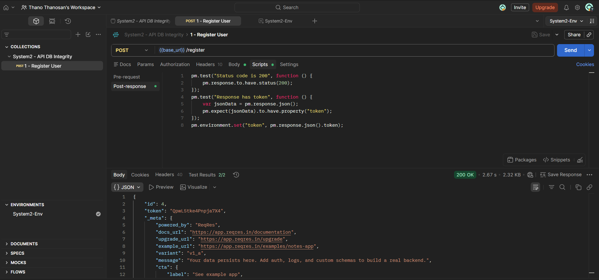</a></td>
<td><b>Register User</b> — <code>POST /register</code> → 200. New user created successfully.</td>
</tr>
<tr>
<td align="center"><b>2</b></td>
<td><a href="./screenshots/system2-02-login-user.png">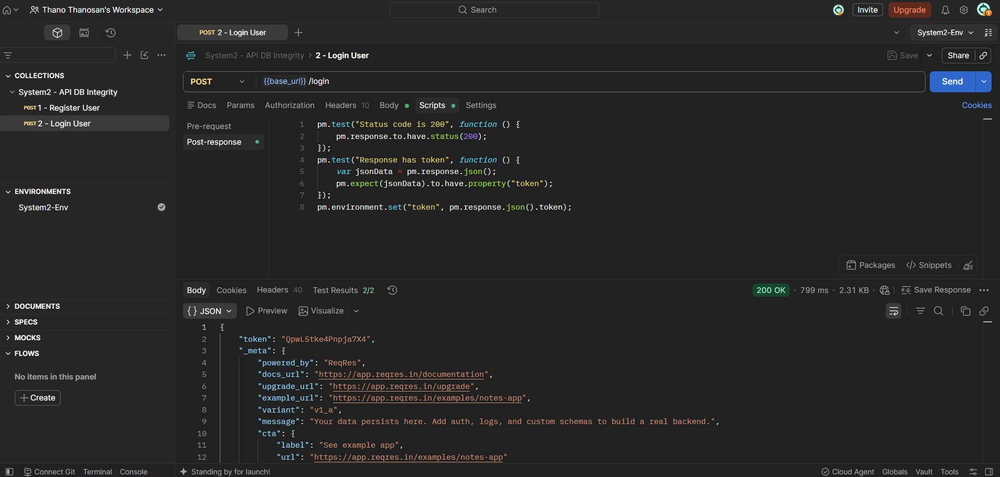</a></td>
<td><b>Login User</b> — <code>POST /login</code> → 200. Auth token returned.</td>
</tr>
<tr>
<td align="center"><b>3</b></td>
<td><a href="./screenshots/system2-03-get-profile.png">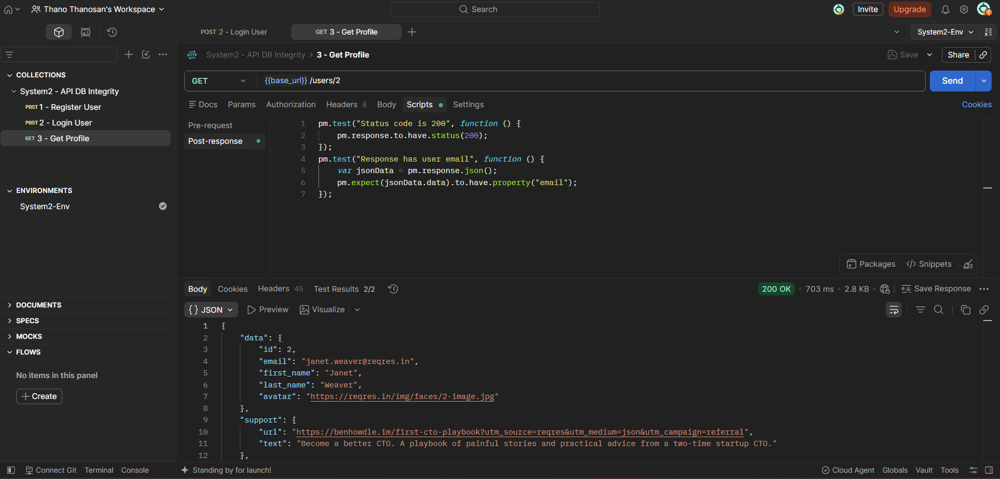</a></td>
<td><b>Get Profile</b> — <code>GET /users/{id}</code> → 200. Profile fetched correctly.</td>
</tr>
<tr>
<td align="center"><b>4</b></td>
<td><a href="./screenshots/system2-04-update-profile.png">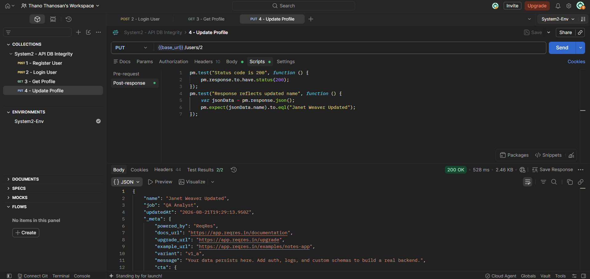</a></td>
<td><b>Update Profile</b> — <code>PUT /users/{id}</code> → 200. Fields updated as expected.</td>
</tr>
<tr>
<td align="center"><b>5</b></td>
<td><a href="./screenshots/system2-05-list-users.png">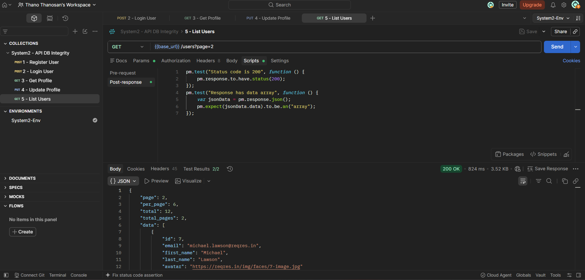</a></td>
<td><b>List Users</b> — <code>GET /users</code> → 200. Paginated user list returned.</td>
</tr>
<tr>
<td align="center"><b>6</b></td>
<td><a href="./screenshots/system2-06-delete-account.png">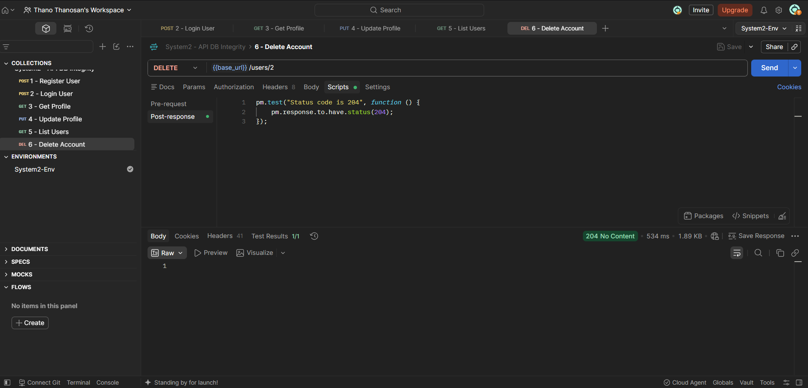</a></td>
<td><b>Delete Account</b> — <code>DELETE /users/{id}</code> → 204. Account removed cleanly.</td>
</tr>
<tr>
<td align="center"><b>7</b></td>
<td><a href="./screenshots/system2-07-get-profile-no-auth.png">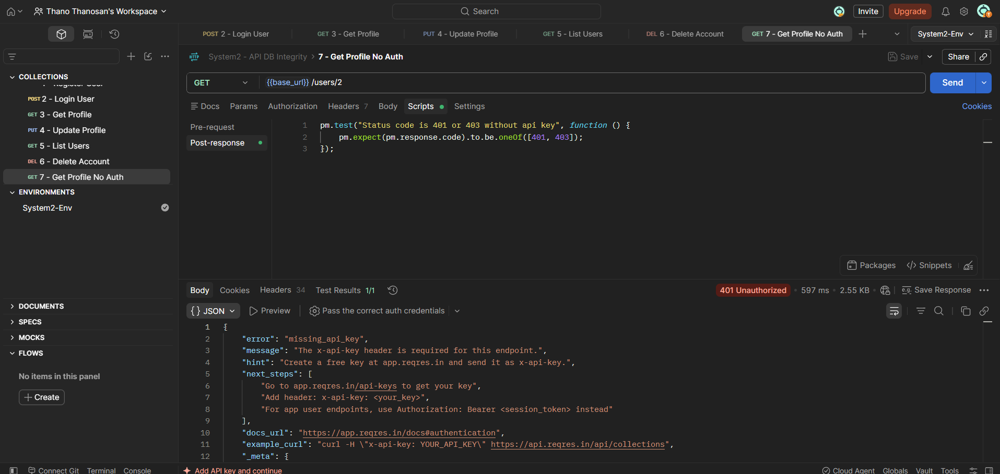</a></td>
<td><b>Get Profile — No Auth</b> → 401. Missing credentials correctly rejected.</td>
</tr>
<tr>
<td align="center"><b>8</b></td>
<td><a href="./screenshots/system2-08-get-profile-invalid-key.png">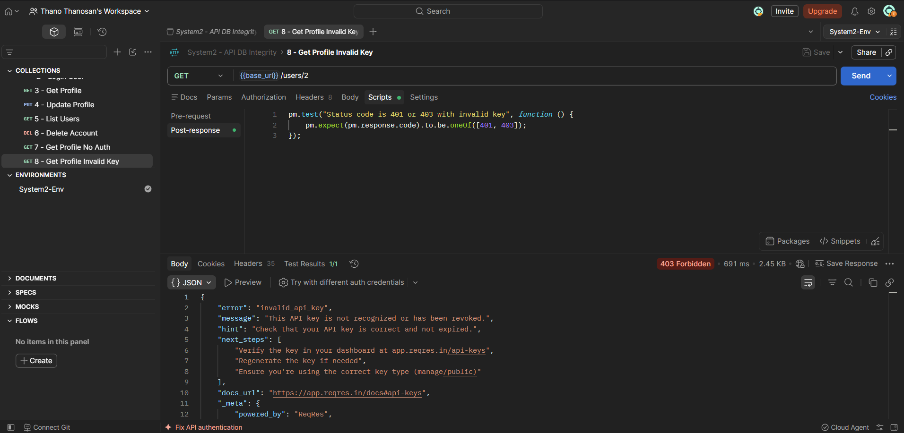</a></td>
<td><b>Get Profile — Invalid Key</b> → 403. Bad credentials correctly rejected.</td>
</tr>
<tr>
<td align="center"><b>9</b></td>
<td><a href="./screenshots/system2-09-create-user-chaining.png">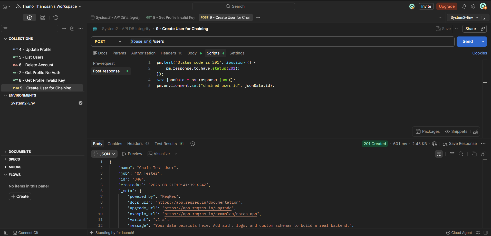</a></td>
<td><b>Create User (Chaining)</b> — <code>POST /users</code> → 201. ID captured for next request.</td>
</tr>
<tr>
<td align="center"><b>10</b></td>
<td><a href="./screenshots/system2-10-get-chained-user-404.png">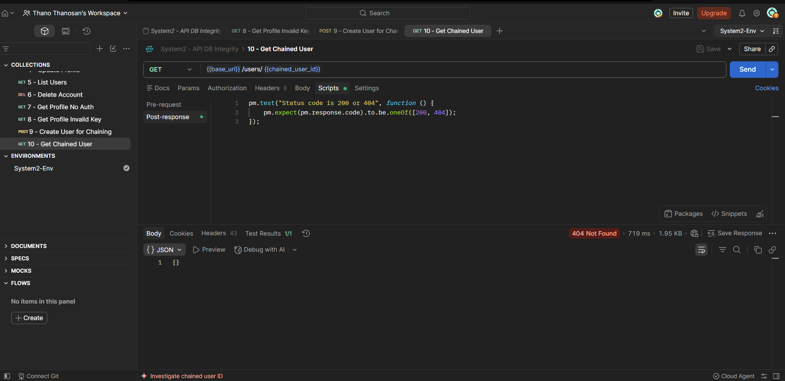</a></td>
<td><b>Get Chained User</b> → 404 (expected). Mock API limitation — see <a href="./rca-log.md">RCA Finding 1</a>.</td>
</tr>
<tr>
<td align="center"><b>11a</b></td>
<td><a href="./screenshots/system2-11a-delete-chained-user-first-call.png">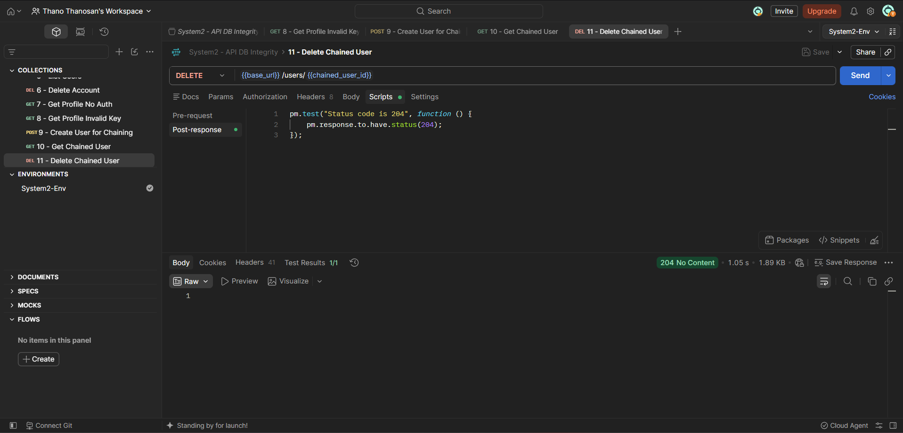</a></td>
<td><b>Delete Chained User — 1st Call</b> → 204. Resource deleted.</td>
</tr>
<tr>
<td align="center"><b>11b</b></td>
<td><a href="./screenshots/system2-11b-delete-chained-user-idempotency.png">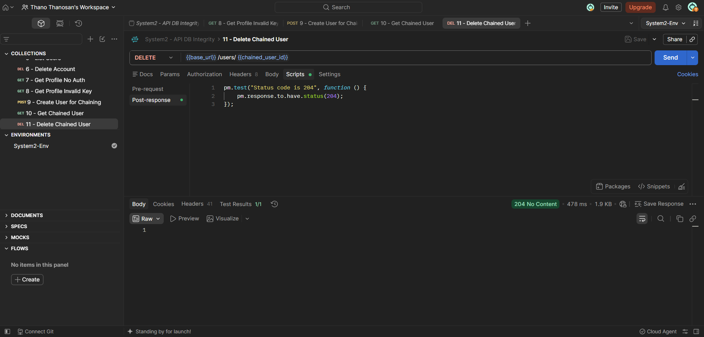</a></td>
<td><b>Delete Chained User — 2nd Call</b> → 204. Idempotency confirmed, no error on repeat.</td>
</tr>
<tr>
<td align="center"><b>12</b></td>
<td><a href="./screenshots/system2-12-register-missing-password.png">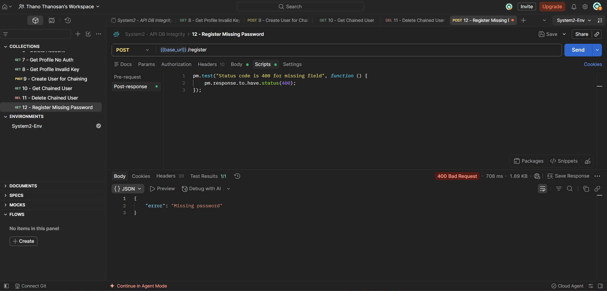</a></td>
<td><b>Register — Missing Password</b> → 400. Validation correctly blocks incomplete data.</td>
</tr>
<tr>
<td align="center"><b>13</b></td>
<td><a href="./screenshots/system2-13-delete-nonexistent-user.png">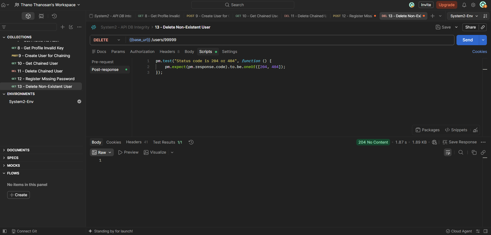</a></td>
<td><b>Delete Non-Existent User</b> → 204. Graceful handling, no crash.</td>
</tr>
</table>

### 🗄️ Part B — Database Integrity Checks (SQL 00–08)

<table>
<tr>
<td width="40" align="center"><b>00a</b></td>
<td><a href="./screenshots/system2-sql-00a-customer-structure.png">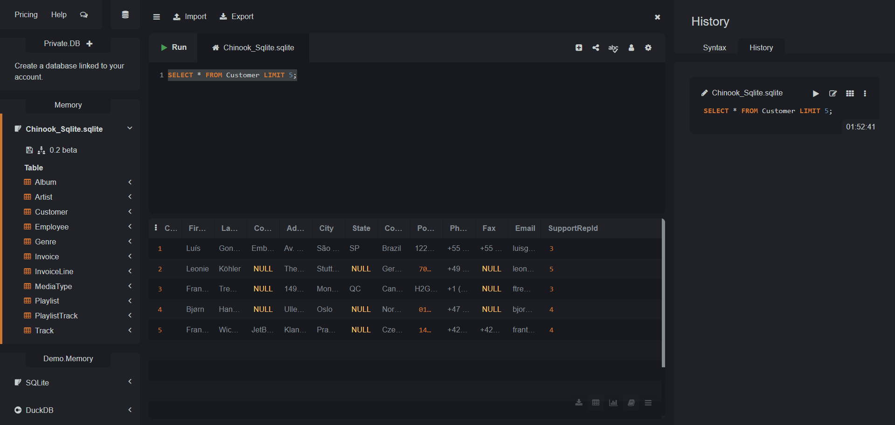</a></td>
<td><b>Customer Table Structure</b> — Schema reviewed before writing integrity queries.</td>
</tr>
<tr>
<td align="center"><b>00b</b></td>
<td><a href="./screenshots/system2-sql-00b-invoice-structure.png">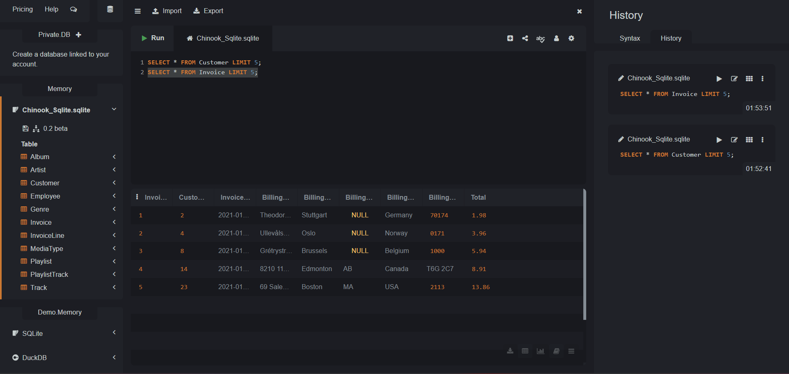</a></td>
<td><b>Invoice Table Structure</b> — Schema reviewed to confirm join keys.</td>
</tr>
<tr>
<td align="center"><b>Q1</b></td>
<td><a href="./screenshots/system2-sql-q1-orphaned-invoices.png">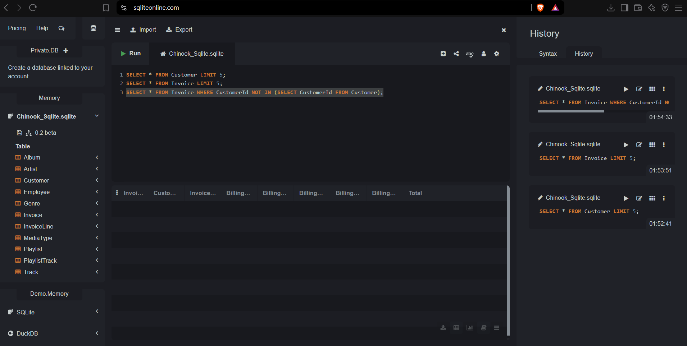</a></td>
<td><b>Orphaned Invoices</b> — 0 rows. No invoice points to a missing customer.</td>
</tr>
<tr>
<td align="center"><b>Q2</b></td>
<td><a href="./screenshots/system2-sql-q2-negative-totals.png">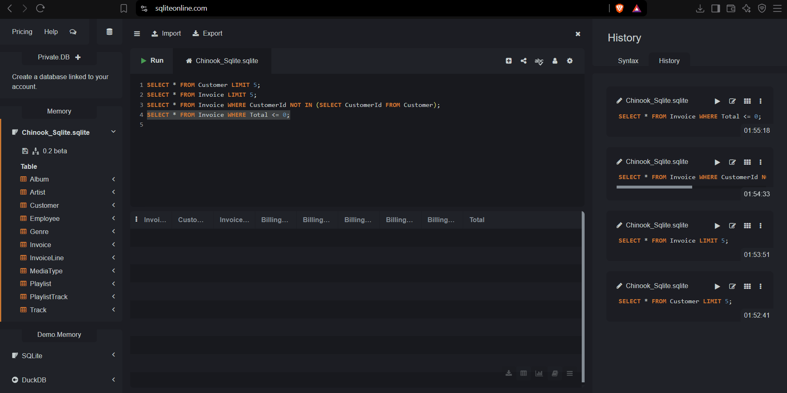</a></td>
<td><b>Negative / Zero Totals</b> — 0 rows. All invoice totals are valid positive values.</td>
</tr>
<tr>
<td align="center"><b>Q3</b></td>
<td><a href="./screenshots/system2-sql-q3-duplicate-emails.png">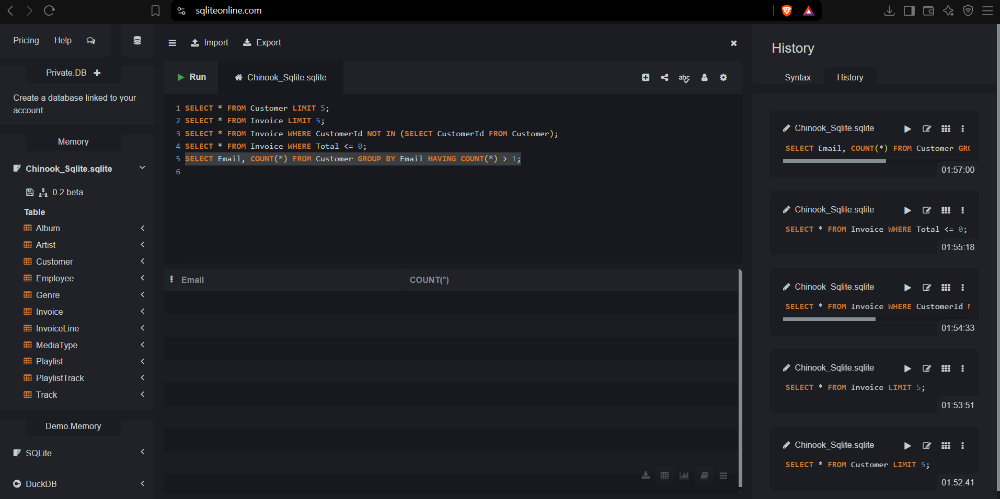</a></td>
<td><b>Duplicate Emails</b> — 0 rows. Customer email uniqueness holds.</td>
</tr>
<tr>
<td align="center"><b>Q4</b></td>
<td><a href="./screenshots/system2-sql-q4-invoice-customer-join.png">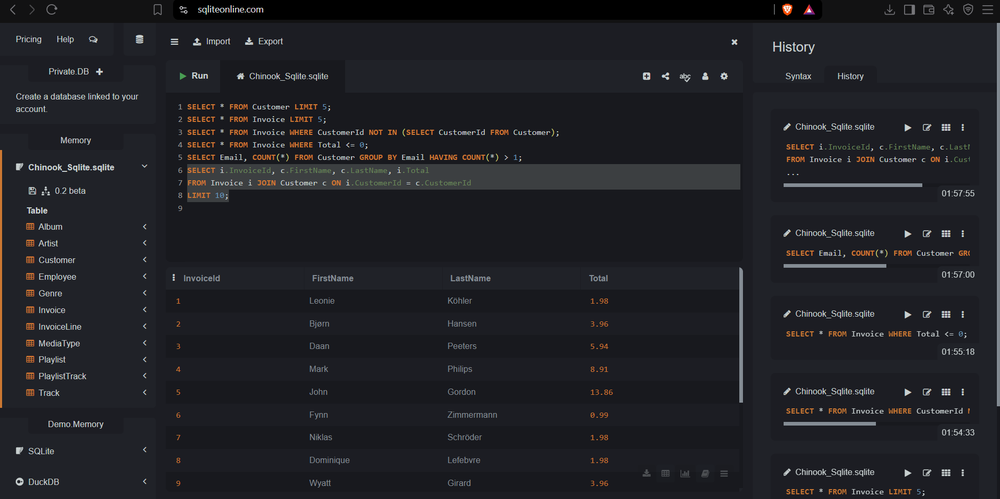</a></td>
<td><b>Invoice–Customer Join</b> — 10/10 sample rows correctly matched.</td>
</tr>
<tr>
<td align="center"><b>Q5</b></td>
<td><a href="./screenshots/system2-sql-q5-country-count.png">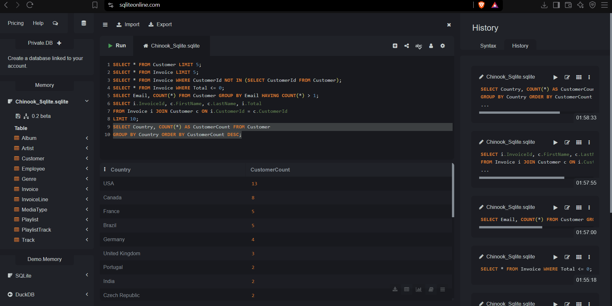</a></td>
<td><b>Customer Count by Country</b> — Distribution reviewed, no anomalies.</td>
</tr>
<tr>
<td align="center"><b>Q6</b></td>
<td><a href="./screenshots/system2-sql-q6-high-volume-customers.png">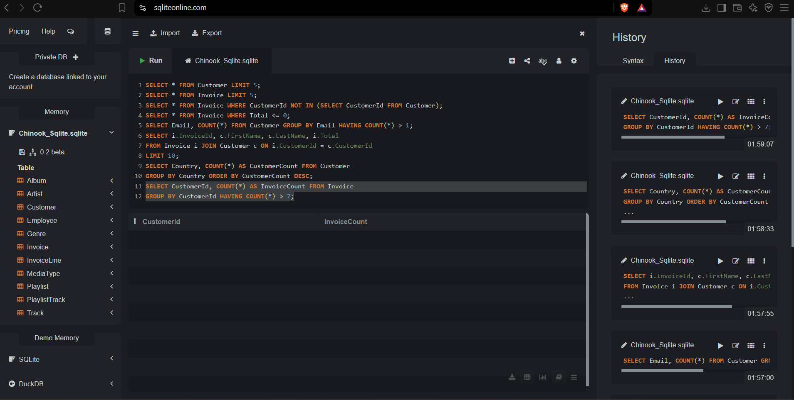</a></td>
<td><b>High-Volume Customer Flag</b> — 0 rows. No unusual order volume detected.</td>
</tr>
<tr>
<td align="center"><b>Q7</b></td>
<td><a href="./screenshots/system2-sql-q7-never-purchased.png">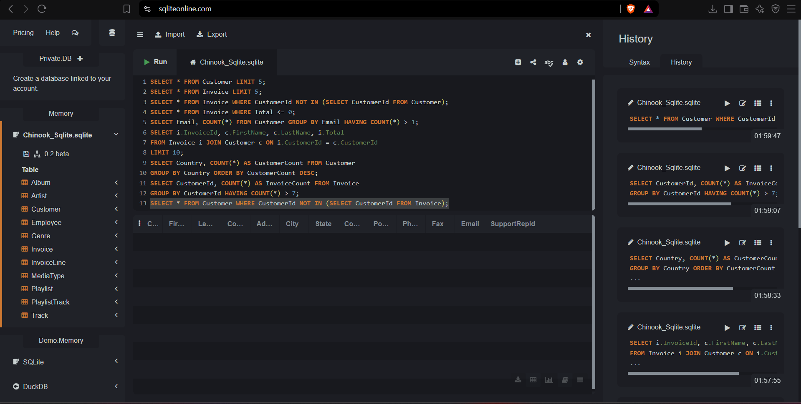</a></td>
<td><b>Non-Purchasing Customers</b> — 0 rows. Every customer has ≥1 invoice.</td>
</tr>
<tr>
<td align="center"><b>Q8</b></td>
<td><a href="./screenshots/system2-sql-q8-top5-highest-invoices.png">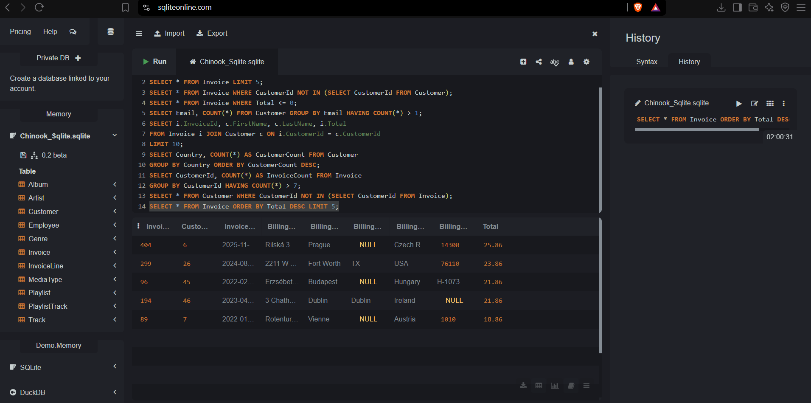</a></td>
<td><b>Top 5 Highest Invoices</b> — Manual fraud-review sample, no outliers found.</td>
</tr>
</table>

<div align="right"><a href="#top">↑ back to top</a></div>

---

## 🔍 Root Cause Analysis Highlights

Full 5-Whys breakdowns are in [`rca-log.md`](./rca-log.md). Summary:

- **Finding 1 — "Get Chained User" 404 after 201 Create:** Not a defect. reqres.in is a mock API and doesn't persist created records to a real backend. In a production system, this exact symptom would trigger a check for write-then-read consistency or replica lag.
- **Finding 2 — Clean SQL result set (5/8 queries returned 0 rows):** Not a defect. Chinook is a well-formed reference dataset. The value delivered is a **validated, reusable query suite** ready to catch real issues against live production data.
- **Finding 3 — DELETE idempotency:** Confirmed PASS — repeated DELETE calls on the same resource correctly return 204 with no error, per REST best practice.
- **Finding 4 — Auth error handling:** Confirmed PASS — API correctly distinguishes missing credentials (401) from invalid credentials (403).

---

## 🛠️ Tools & Tech Used

| Tool | Purpose |
|---|---|
| 🟠 **Postman** | API request design, chaining, environment variables, collection export |
| 🌐 **reqres.in** | Mock REST API used for CRUD / auth lifecycle testing |
| 🗄️ **SQLite (Chinook DB)** via sqliteonline.com | SQL-based data integrity testing |

### ▶️ Run the Postman Collection Yourself
1. Open Postman → **Import**
2. Select [`postman/System2-API-DB-Integrity.postman_collection.json`](./postman/System2-API-DB-Integrity.postman_collection.json)
3. Run the full collection top-to-bottom (or use the **Collection Runner**) to reproduce all 13 results.

---

## 👤 Author

<div align="center">

Part of the **[AI-Driven QA Portfolio](../)** — a series of projects demonstrating API testing, database validation, and structured root-cause analysis using AI-assisted QA workflows.

📄 Full narrative report → [`integrity-report.md`](./integrity-report.md) &nbsp;|&nbsp; 🔍 RCA details → [`rca-log.md`](./rca-log.md)

<a href="#top">↑ back to top</a>

</div>
